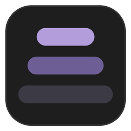
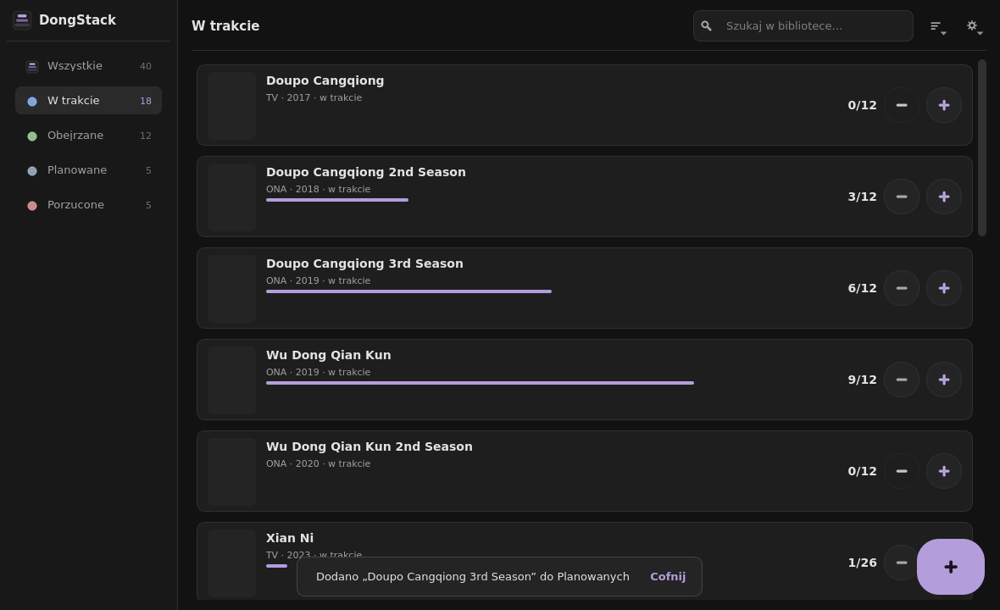
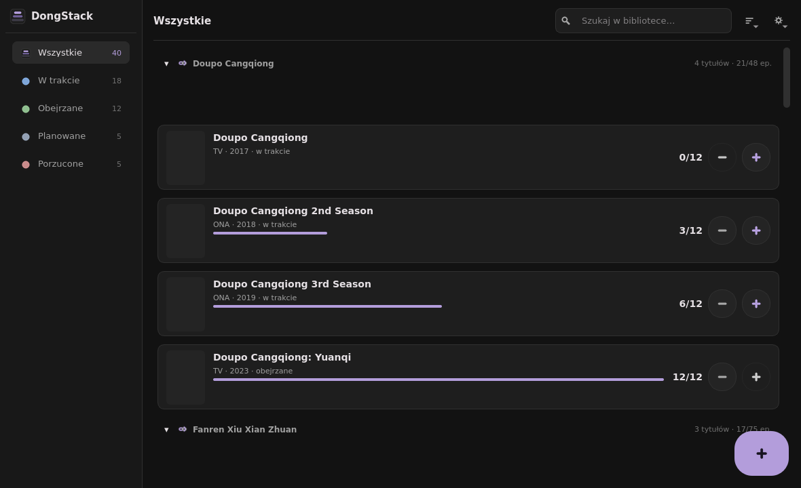

<div align="center">



# 🀄 DongStack

**Osobisty tracker donghua na Windows — `+1` jednym kliknięciem,
serie łączone w uniwersa i układane w kolejności oglądania.**

[](https://github.com/karnyjohnny/dongstack/actions/workflows/ci.yml)
[](https://github.com/karnyjohnny/dongstack/actions/workflows/release.yml)
[](#-instalacja-windows)
[](#-uruchomienie-ze-źródeł)
[](LICENSE)

*zaprojektowany od zera pod Core 2 Duo / 2 GB RAM / Windows 7 SP1*

</div>

> 
>
> *Ciemny, warstwowy dashboard: sidebar ze statusami i licznikami, karty z okładką,
> postępem i zawsze widocznymi `[−] [+]`, SnackBar z Undo, FAB dodawania.*
>
> 
>
> *Uniwersa: franczyzy ułożone w kolejności oglądania (S1 → S2 → S3 → spin-offy),
> nagłówki z łącznym postępem, zwijanie jednym kliknięciem.*

---

## ✨ Dlaczego DongStack?

- **`[−] 12/24 [+]` zawsze na widoku.** Zmiana odcinka = **jedno kliknięcie**, bez formularzy,
  dialogów i czekania na bazę (zapis idzie w tle, UI reaguje w <50 ms).
- **Undo zamiast „Czy na pewno?”** — operacje odwracalne cofasz z paska SnackBar, nie z `QMessageBox`.
- **Uniwersa:** serie łączą się w łańcuchy prequel→sequel (dane z oficjalnego MAL API
  `related_anime`), a dashboard układa je **od 1. sezonu do ostatniego, potem filmy i specjały**.
  Koniec z „s2, s5, s1, s7” w losowej kolejności.
- **Offline-first:** lokalna baza SQLite + cache wyników i okładek — aplikacja działa bez sieci,
  a MAL odwiedza oszczędnie (≤1 zapytanie/s, kolejka, backoff wykładniczy).
- **Flat dark mode warstwami jasności** — zero blur/shadow/animowanych gradientów;
  interfejs nie marnuje CPU na Intel GMA 4500MHD.
- **Jeden katalog / jeden exe:** artefakty buduje GitHub Actions z sumami SHA256.

## ⬇️ Instalacja (Windows)

1. Wejdź w [Releases](https://github.com/karnyjohnny/dongstack/releases) i pobierz:
   - **`DongStack-…-onedir.zip`** — ⭐ **rekomendowane**, zwłaszcza na starszym sprzęcie
     (najszybszy start; rozpakuj i uruchom `DongStack\DongStack.exe`), albo
   - **`DongStack-…-portable.exe`** — pojedynczy plik „wrzuć i uruchom” (wolniejszy start:
     rozpakowuje się do `%TEMP%` przy każdym uruchomieniu).
2. Zweryfikuj integralność: `certutil -hashfile DongStack-….zip SHA256` i porównaj z `SHA256SUMS.txt`.
3. **Pierwsze uruchomienie:** aplikacja poprosi o **darmowy MAL Client ID**
   (myanimelist.net → Account Settings → API → Create ID) — albo kliknij *„Pomiń”*,
   a DongStack przejdzie na źródło awaryjne AniList (bez rejestracji).

**Wymagania:** Windows 7 SP1 lub nowszy (x64/x86), ~200 MB wolnego miejsca.
Na „czystym” Win7 SP1 zalecane aktualizacje: KB2533623, KB2999226 (UCRT).
Dane trzymasz u siebie: `%LOCALAPPDATA%\DongStack\`.

## 🚀 Uruchomienie ze źródeł

### Windows 10/11 (dev)

```powershell
git clone https://github.com/karnyjohnny/dongstack.git
cd dongstack
python -m venv .venv ; .\.venv\Scripts\Activate.ps1
pip install -r requirements.txt -r requirements-dev.txt
python -m app.main            # start (GUI od kamienia M2)
python -m app.main --selftest # benchmark rdzenia (JSON)
```

### Windows 7 SP1 (maszyna docelowa)

Oficjalny CPython 3.13 nie wspiera Win7 — użyj utrzymanego buildu
[Python-Win7](https://github.com/Alex313031/Python-Win7) (suma kontrolna w `packaging/python-win7.json`):

```bat
python-3.13.5-amd64-full.exe /quiet InstallAllUsers=0 PrependPath=1 Include_test=0
git clone https://github.com/karnyjohnny/dongstack.git
cd dongstack
python -m venv .venv && .venv\Scripts\activate
python -m pip install -r requirements.txt -r requirements-dev.txt
python -m app.main
```

## 👩‍💻 Dla deweloperów

```text
app/
├── core/        # config (warstwy + maskowanie sekretów), paths (_MEIPASS-aware), logi, .env
├── domain/      # frozen dataclasses (Donghua, Universe, …), UndoStack
├── data/        # SQLite: connection/PRAGMA, migracje+backup, repozytoria (JEDYNY SQL), cache
├── services/    # watch_order: topo-sort relacji MAL + heurystyka sezonów EN/CN
├── api/         # MAL/AniList clients (M4), TokenBucket, backoff, circuit breaker
├── workers/     # DbWorker + NetworkWorker (M3/M4) — nigdy w wątku GUI
├── controllers/ # logika ekranów (M3/M4)
├── gui/         # PyQt5: MainWindow, dashboard, AddDialog, SnackBar (M2+)
└── resources/   # QSS + ikony/logo generowane kodem (tools/generate_branding.py)
```

- **Testy:** `pytest tests/unit tests/gui` (GUI: `QT_QPA_PLATFORM=offscreen`).
  Nagrania live API siedzą w `tests/fixtures/` — CI nie potrzebuje sieci ani sekretów.
- **Testy live (opt-in):** `RUN_LIVE_API_TESTS=1 MAL_CLIENT_ID=… pytest tests/live -m live`.
- **Lint:** `ruff check .` (baseline składni **py38** — celowo, patrz `docs/`).
- **Self-test rdzenia:** `python -m app.main --selftest` (JSON: czasy insertów/update, wątki).
- **Ikony/logo:** `pip install -r requirements-tools.txt && python tools/generate_branding.py`.

### Budowanie `.exe` (PyInstaller)

```bat
pip install -r requirements-dev.txt
python -m PyInstaller packaging\dongstack.spec --noconfirm                 :: onedir → dist\DongStack\
set DHT_ONEFILE=1
python -m PyInstaller packaging\dongstack.spec --noconfirm --distpath dist-onefile   :: portable
```

CI/CD: tag `v*` → `release.yml` buduje matrix `win32/amd64 × onedir/onefile` na przypiętym
buildzie Python-Win7 3.13.5 (commit+SHA256), instaluje runtime z `requirements.lock.txt`
(`--require-hashes`) i publikuje GitHub Release z `SHA256SUMS.txt`.

## ⚙️ Konfiguracja

| Zmienna / plik | Znaczenie |
|---|---|
| `MAL_CLIENT_ID` | Client ID z panelu MAL (albo first-run dialog / `config.json`) |
| `MAL_CLIENT_SECRET` | **nieużywany w v1** — nigdy nie commituj; patrz `.env.example` |
| `DONGSTACK_PREFERRED_PROVIDER` | `mal` (domyślnie) lub `anilist` |
| `DONGSTACK_HOME` | nadpisanie katalogu danych (tryb portable/testy) |
| `DONGSTACK_LOG_LEVEL` | `DEBUG/INFO/WARNING/ERROR` |

Sekrety trzymaj w `.env` (w `.gitignore`). Logi z automatycznym maskowaniem sekretów:
`%LOCALAPPDATA%\DongStack\logs\`.

## 🏗️ Architektura

Pełna specyfikacja techniczna (architektura, budżety wydajności, rygory R1–R15,
macierz kompatybilności Win7/Py3.13, PyInstaller, CI/CD): **[`docs/SPECYFIKACJA-TECHNICZNA.md`](docs/SPECYFIKACJA-TECHNICZNA.md)**.
Koncepcja UX/HCI (one-click, undo, skeleton, dark mode): `docs/` + dokument wejściowy projektu.

## 🐛 Rozwiązywanie problemów

| Objaw | Rozwiązanie |
|---|---|
| Win7: exe nie startuje | zainstaluj KB2533623 + KB2999226 (UCRT); sprawdź `tools\smoke_test.ps1` |
| SmartScreen/AV przy `portable.exe` | użyj wariantu **onedir ZIP** (mniej fałszywych alarmów) i weryfikuj SHA256 |
| Wolny start wariantu portable | to oczekiwane (ekstrakcja do `%TEMP%`); na HDD wybierz onedir |
| „Brak połączenia z MAL” | aplikacja serwuje cache i proponuje AniList; Client ID sprawdź w ustawieniach |

## 📜 Licencja

Kod źródłowy: **MIT** (Copyright (c) 2026 KarnyJohnny).
Dystrybuowane binaria łączą się z PyQt5/Qt (GPL v3) — patrz notka w [`LICENSE`](LICENSE).

## 🙏 Podziękowania i atrybucja

- Dane i okładki: **MyAnimeList.net** (oficjalne API v2) — *DongStack nie jest afiliowany z MAL*.
- Źródło awaryjne: **AniList** — *This product uses the AniList API but is not endorsed
  or certified by AniList.*
- Build CPython dla Windows 7: [Alex313031/Python-Win7](https://github.com/Alex313031/Python-Win7).
